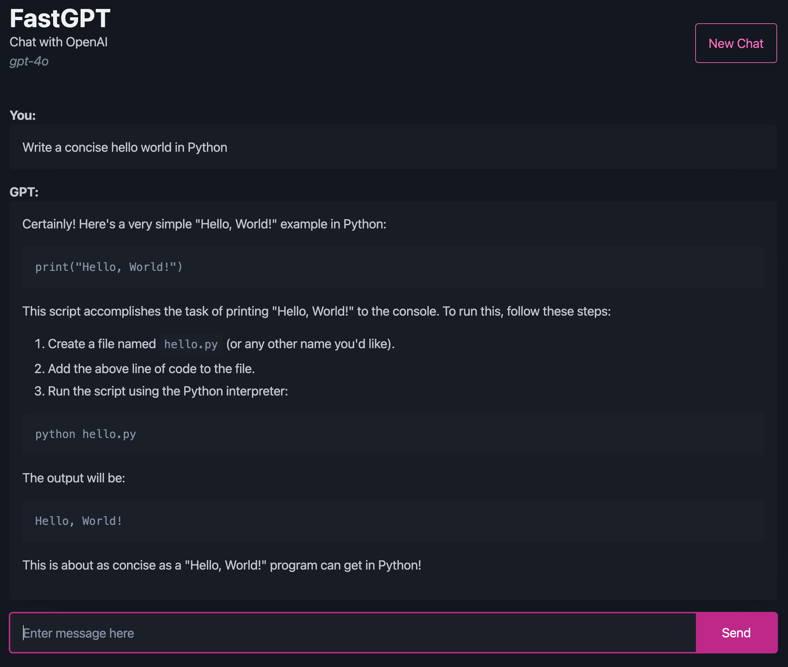

# FastGPT

FastAPI + HTMX chat wrapper for OpenAI API

## Run Locally
Create .env with these environment variables

- OPENAI_API_KEY
- MODEL_NAME
- LOGIN_PASSWORD

```
poetry init
uvicorn app.main:app --reload
```

## Deploy to Fly.io

```
fly launch
cat .env | fly secrets import
fly deploy
```

## Built with
- FastAPI + Jinja2
- HTMX
- Pico CSS


## Screenshot
